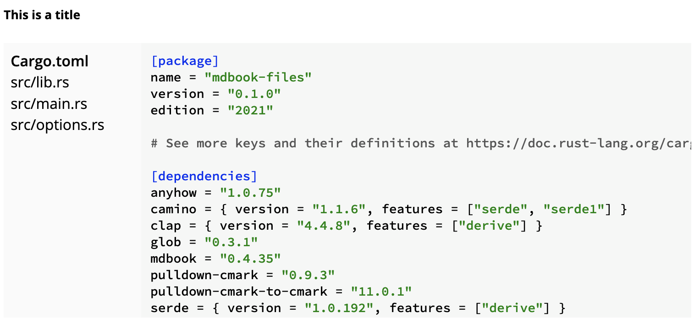

# mdbook-files

A (work-in-progress) preprocessor for [mdBook][mdBook] which renders files from
a directory as an interactive widget. The idea here is to make it easy to show
project layouts concisely, without needing too much space to render every file
sequentially.



## Example

You can check out the example by launching `mdbook` in the example directory
in this repository.

```
mdbook serve
```

## Usage

Install `mdbook-files` using `cargo`:

```
cargo install mdbook-files
```

Put the following into your `book.toml`:

```toml
[preprocessor.files]
prefix = "examples"
```

The prefix is a path, relative to which files are to be included.  It is
mandatory to give a prefix. Every include path in the book must be within this
prefix.

You will also need to add the `style.css` from this repository to your list of
extra CSS files:

```
[output.html]
additional-css = ["style.css"]
```

To use it, add something like this to your book:

    ```files
    title = "Files in subfolder"
    paths = ["subfolder/**"]
    ```

This will produce a widget with all files in `examples/subfolder`, with the given
title. The content of this is a TOML document which contains configuration.

## License

MIT.

[mdBook]: https://github.com/rust-lang/mdBook/
