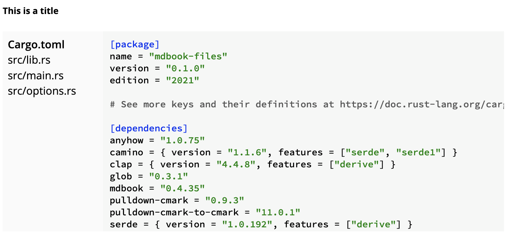

# Getting Started

Preprocessor for [mdBook][mdBook] which renders files from a directory as an
interactive widget, with syntax highlighting.

I wrote this to make it easy to showcase examples inside books written using
mdBook, which have more than just one file, such as entire Rust crates. The
file picker makes it easy to browse around, and the syntax highlighting works
just as simple code examples would work.

[mdBook]: https://github.com/rust-lang/mdBook
